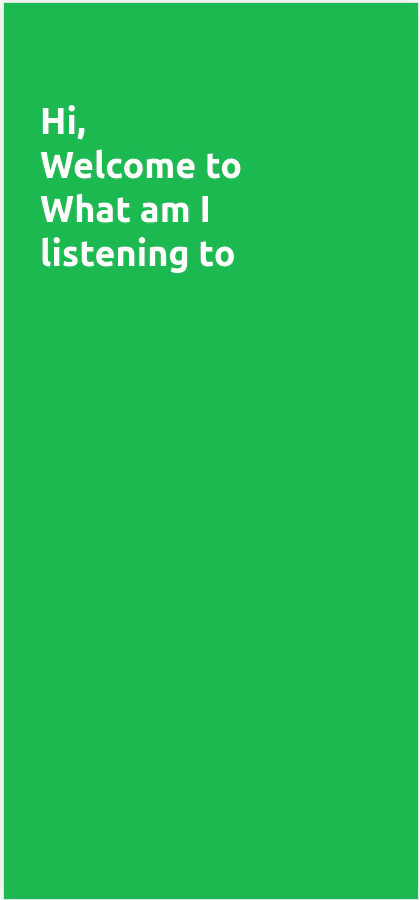

#  What am I listening to

> Are you always trying to find out more about yourself?

> Why dont you give it a try?

> WAILT helps you to analyse your spotify behavior

<!-- 

    <a href="https://konstantinlob.github.io/What-am-I-listening-to/" target="_blank" rel="noreferrer noopener" style="margin: 0px auto; padding: 10px 16px; background-color: #1DB954; color: white; border-radius: 20px; font-weight: 700;">
        Test it out
    </a>

 -->

[Test it out](https://konstantinlob.github.io/What-am-I-listening-to/)

